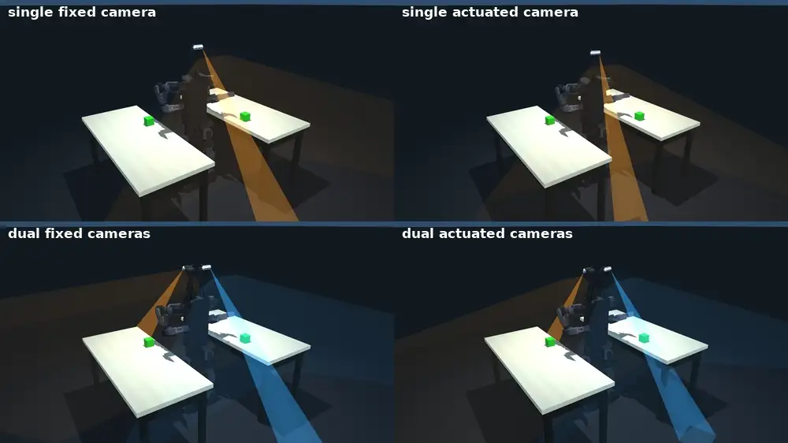
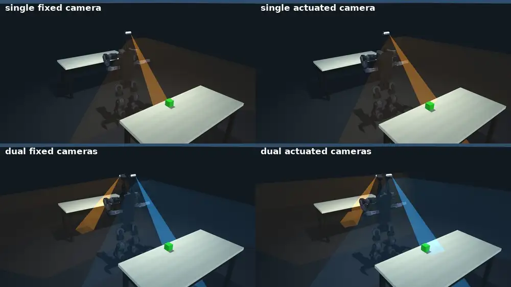

<div align="center">

# Duke Humanoid V2: simulation and training

**The reproduction package for the visible-reachable workspace: the workspace study, the
two-target reach-and-grasp benchmark, the robot assets, and the checkpoints behind the numbers.**

**Paper** (preprint coming) &middot;
**[Project entry point](https://github.com/generalroboticslab/duke_humanoid_v2)** &middot;
**[Onboard control stack](https://github.com/generalroboticslab/duke_humanoid_v2_deploy)** &middot;
**[See it run](#see-it-run)** &middot;
**[Reproduce the paper](REPRODUCE.md)**

[](LICENSE)


</div>


<div align="center"><i>What this repository computes: the visible-reachable workspace of six
humanoid platforms. Magenta to orange is visible-reachable, blue is reachable but blind.</i></div>

VRW asks where a robot can both reach and see. Take the reachable workspace, then keep only
the targets that can also be observed from a configuration that reaches them. The joints spent
realizing the reach do not count as gaze actuation, which is why a wrist camera on the reaching
arm is not an independent view. Running that measure over eight platforms is what the code here
does, and it is what chose this robot's camera count, mounting, and articulation.

The robot, its hardware specifications, and the onboard control stack live at
[**duke_humanoid_v2**](https://github.com/generalroboticslab/duke_humanoid_v2), which is the
entry point for the project. This repository is one of its two submodules.

This is a generated export of the research repository; the directory layout matches it, so
import paths in the paper's scripts work unchanged.

## Contents

- [Install](#install)
- [See it run](#see-it-run)
- [What is in here](#what-is-in-here)
- [Reproducing the paper](#reproducing-the-paper)
- [Citation](#citation)

## Install

Needs an NVIDIA GPU and Python 3.12.

```bash
pip install -r requirements.txt
# nvidia-curobo: only the benchmark needs it
# https://curobo.org/get_started/1_install_instructions.html
```

`requirements.txt` is deliberately unversioned. This study tracks current `mjlab` and
`mujoco-warp`, and the numbers here come from the shipped caches and checkpoints rather than from
a live solve, so a pin would go stale without protecting a result. Developed against Python 3.12,
`mjlab` 1.6, `mujoco` 3.11, `warp-lang` 1.16, `torch` 2.10, CUDA 12.9, on Ubuntu 22.04.

Headless machines need `MUJOCO_GL=egl` in front of any command that renders.

## See it run

Three things you can watch, one command each. Every one of them reads weights or caches already
in this checkout: no training, no sweep, no downloads.

**1. Watch the locomotion policy.** Opens a MuJoCo viewer with the whole-body policy driving the
robot:

```bash
python mj_envs/run.py play --task HumanoidRmaVelEstArmFlashSacv2ybsk_yaw_s4MixedArmsCam
```

No checkpoint argument needed. A fresh clone has no `runs/`, so `play` falls back to the pinned
weight in `mj_envs/tasks/visual_manipulation/test/checkpoints/` and prints which one it picked.
The other two shipped policies are `...SingleCam` and `G1RmaVelEstArmFlashSacStudentOnlyg1bsk2`.

**2. Watch the two-target task.** One robot, one scenario, the full mission the benchmark scores:

```bash
python mj_envs/tasks/visual_manipulation/test/curobo_reach_verify.py     --robot v2 --scenario bimanual_mixed_close --dynamic --mpc --walk --camera --view
```

Needs cuRobo. This is the paper's comparison in one command: run it again with `--robot v2_fixed`
to watch the same mission with the cameras welded instead of actuated. Scenarios are
`left_right_close`, `left_right_far`, `front_back_close`, `front_back_far`,
`bimanual_mixed_close`, `bimanual_mixed_front_back_close`. Drop `--view` to run headless and print
only the verdict. What each flag changes is in
[`mj_envs/tasks/visual_manipulation/`](mj_envs/tasks/visual_manipulation/).

<table>
<tr>
<td width="50%"></td>
<td width="50%"></td>
</tr>
<tr>
<td><b>left_right_close.</b> Both targets within reach.</td>
<td><b>front_back_far.</b> Benches at 0.8 m, so the robot locates the targets, then walks.</td>
</tr>
</table>

Each panel above is one camera configuration: `v2_single_fixed`, `v2_single` on the top row,
`v2_fixed`, `v2` on the bottom.

**3. Regenerate the workspace figures.** Seconds, from the shipped caches, no GPU sweep:

```bash
MUJOCO_GL=egl python mj_envs/asset_zoo/reachability_study/plot_workspace_curobo.py --reach-visible-compare
python mj_envs/asset_zoo/reachability_study/camera_count_ablation.py
```


The measure those figures report, as a volume: the same arms and the same body, differing only in
whether the camera joints are free. Blue is what VRW exists to expose, space the arm can reach and
the cameras cannot see. Rendered by `plot_workspace_curobo.py --vrw-video --robot v2`.

## What is in here

The four directories worth opening first each have their own README, so you can navigate by
browsing rather than by grepping:

| Directory | What it holds |
| --- | --- |
| [`asset/`](asset/) | Every robot model, with the upstream source and license of each comparison platform. |
| [`asset/duke_v2/`](asset/duke_v2/) | This robot: body, head-camera gimbals, end effectors, and how to view them. |
| [`mj_envs/asset_zoo/reachability_study/`](mj_envs/asset_zoo/reachability_study/) | The visible-reachable workspace computation and both workspace figures. |
| [`mj_envs/tasks/visual_manipulation/`](mj_envs/tasks/visual_manipulation/) | The two-target benchmark, its scenarios, and the mission flags. |

The rest:

- `asset/create/` is the MJCF/URDF build tooling. The export command behind each shipped cuRobo
  URDF is recorded in the corresponding `curobo/*_robot_cfg.py`.
- `asset/toddlerbot_2xm_gripper/` is a sixth supported platform, included as a worked example
  though no paper figure reports it. `run_eta2_platforms.py` scores it as its own column, it is
  the smallest robot here and so the cheapest to regenerate a payload for, and it is the only
  robot that exercises the coupled-neck branch of `gpu_visibility` (`_apply_coupling`, -1/0.909
  gear).
- `mj_envs/asset_zoo/` has robot constants, scene objects, and the reachability study.
- `mj_envs/tasks/humanoid_velocity/` has the locomotion task, rewards, observations, experiments.
- `mj_envs/flash_sac/` and `mj_envs/ppo/` are the RL training stacks.
- `mj_envs/tasks/visual_manipulation/test/checkpoints/` has the pinned policy weights, with the
  md5 and training command for each.

Precomputed data:

- `mj_envs/asset_zoo/reachability_study/aggregated_cache/` holds the aggregated VRW payloads that
  the figure scripts read, which is why Fig. 2 and Fig. 5 regenerate in seconds, not a GPU sweep.
- `mj_envs/asset_zoo/cache/` holds safe-arm-pose and arm-collision-graph payloads for the two
  robots that are trained and evaluated, `humanoid_v21` and `unitree_g1`. The other platforms'
  safe-arm-pose caches (~1.4 GB) are left out because the figures read `aggregated_cache`.
  Three samplers regenerate them, split by how a pose is certified collision-free:

  | robots | script |
  | --- | --- |
  | `humanoid_v21`, `unitree_g1` | `mj_envs/asset_zoo/generate_safe_arm_poses.py` |
  | `booster_t1`, `fourier_gr3`, `pal_talos` | `mj_envs/asset_zoo/reachability_study/generate_mjcf_safe_arm_poses.py` |
  | `toddlerbot`, `apptronik_apollo` | `mj_envs/asset_zoo/reachability_study/generate_curobo_safe_arm_poses.py` |

  Each takes `--robot <name> --samples 4096 --seed 42` and writes into
  `mj_envs/asset_zoo/cache/`. Run one before `generate_workspace_curobo.py --robot <name>`.

Long-form method notes are in `mj_envs/asset_zoo/reachability_study/readme_reachability.md` and
`mj_envs/tasks/visual_manipulation/readme_visual_manipulation.md`.

### What this export leaves out

The original CAD (`*.step`), the high-resolution render meshes (`*_high_res.obj` and
`humanoid_v21_high_res.xml`), recorded rollout videos (`media/`), and the platforms that belong to
separate projects or that no result uses: Argus, the ballbot, Berkeley Humanoid Lite, OpenArm.
Scripts that reference those platforms still import; only those `--robot` values are unavailable.

## Reproducing the paper

Every figure this package covers regenerates from data already in the repository. Only the
benchmark needs a sweep.

| | regenerates in | command |
| --- | --- | --- |
| Fig. 2, cross-platform VRW comparison | seconds, from shipped caches | `plot_workspace_curobo.py --reach-visible-compare` |
| Fig. 5, camera count x articulation | seconds, from shipped caches | `camera_count_ablation.py` |
| Fig. 6, task keyframe grid | seconds, from shipped frames | `make_keyframe_figure.py` |
| Table IV, 900-trial benchmark | hours, multi-GPU | `dyn_sweep.py` |
| The locomotion policy | days | `run.py train` |

**[REPRODUCE.md](REPRODUCE.md)** has the full recipe for each: exact commands, the checkpoint
provenance table, the expected benchmark numbers, the regression check, and a record of what was
verified on which hardware.

## Citation

The preprint is not posted yet. When it is, this block and the link row at the top will carry the
reference.

```bibtex
@misc{duke_humanoid_v2,
  title  = {Visible-Reachable Workspace for Perception-Aware Humanoid Design},
  author = {General Robotics Lab, Duke University},
  year   = {2026},
  url    = {https://github.com/generalroboticslab/duke_humanoid_v2}
}
```

## License

Apache-2.0, see [`LICENSE`](LICENSE). Third-party robot models under `asset/` keep their upstream
licenses alongside their meshes.
