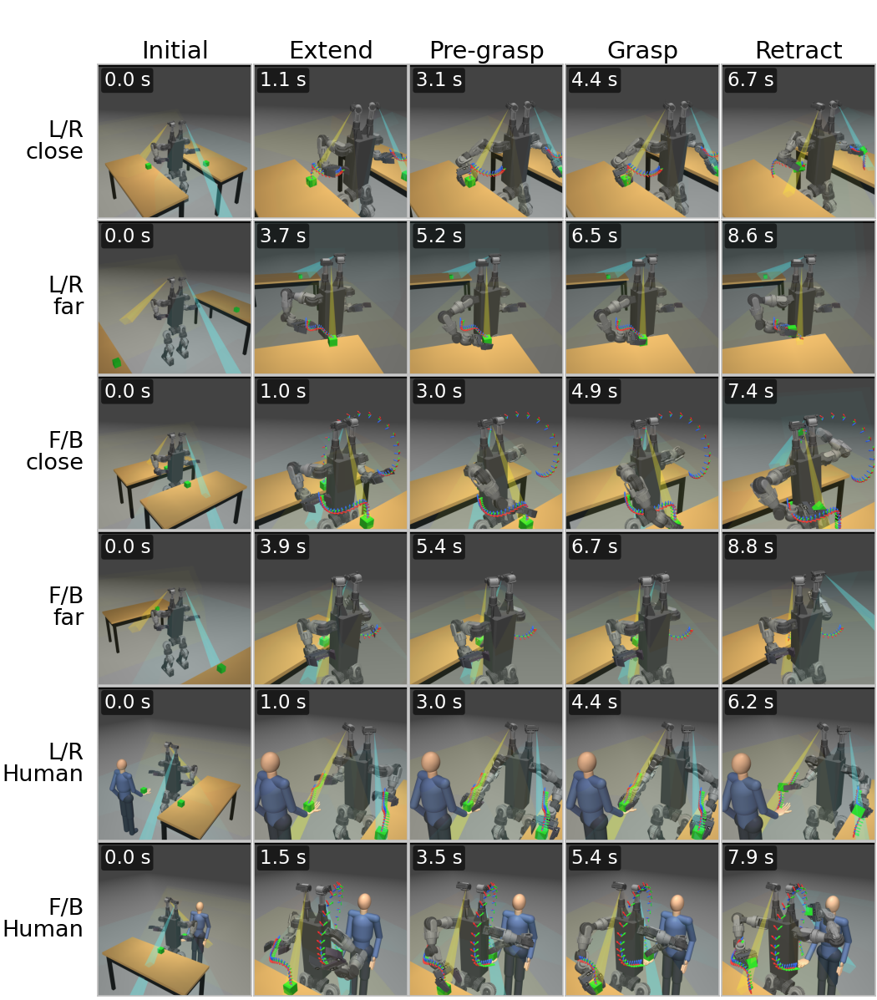

# Duke Humanoid V2 — simulation and training

Policy training and the reproduction package for the visible-reachable workspace (VRW) paper:
the workspace study, the two-target reach-and-grasp benchmark, the robot assets, and the
checkpoints behind the reported numbers.

The robot, its hardware specifications, and the onboard control stack live at
[**duke_humanoid_v2**](https://github.com/generalroboticslab/duke_humanoid_v2), which is the
entry point for the project. This repository is one of its two submodules.



The six benchmark scenarios, one row each, regenerated by the last command in Reproduce below.

This is a generated export of the research repository; the directory layout matches it, so
import paths in the paper's scripts work unchanged.

Everything needs an NVIDIA GPU. All figures below were regenerated on a single RTX 4090.

## Install

External dependencies are not vendored:

```bash
pip install -r requirements.txt
# nvidia-curobo: follow https://curobo.org/get_started/1_install_instructions.html
```

`requirements.txt` is deliberately unversioned. This study tracks current `mjlab` and
`mujoco-warp`, and the numbers below come from the shipped caches and checkpoints rather than from
a live solve, so a pin would go stale without protecting a result. Developed against Python 3.12,
`mjlab` 1.6, `mujoco` 3.11, `warp-lang` 1.16, `torch` 2.10, CUDA 12.9.

Headless machines need `MUJOCO_GL=egl` in front of any command that renders.

## Reproduce

### Locomotion policy (training)

```bash
python mj_envs/run.py train --task HumanoidRmaVelEstArmFlashSacv2ybsk_yaw_s4MixedArmsCam
python mj_envs/run.py play  --task HumanoidRmaVelEstArmFlashSacv2ybsk_yaw_s4MixedArmsCam
```

The other task classes behind the reported numbers are
`HumanoidRmaVelEstArmFlashSacv2ybsk_yaw_s4SingleCam` and
`G1RmaVelEstArmFlashSacStudentOnlyg1bsk2`.

You do not need to train anything to reproduce the tables. The checkpoints they were computed
from are in `mj_envs/tasks/visual_manipulation/test/checkpoints/`, and that directory's
`README.md` lists the md5 and the training command for each one. Only the weights named in
`dyn_sweep.PINS` are shipped. The same `README.md` describes the candidates that were evaluated
and rejected, whose weights are not included.

### Two-target reach-and-grasp benchmark (Table IV)

```bash
python mj_envs/tasks/visual_manipulation/test/dyn_sweep.py \
    --robots g1,v2_fixed,v2,v2_single_fixed,v2_single --out <run_name>
python mj_envs/tasks/visual_manipulation/test/dyn_aggregate.py <run_dir>
```

6 scenarios x 3 repeats x 10 seeded layouts = 900 trials. This runs multi-GPU, and `--hosts`
sets the device topology. The GPU contact solver is not bit-reproducible, which is why each
configuration is repeated 3 times.

The `--robots` order above is Table IV's column order. `dyn_aggregate.LABEL` holds the mapping:

| `--robots` value | Table IV column |
| --- | --- |
| `g1` | G1 |
| `v2_fixed` | Fix_2 |
| `v2` | Act_2 |
| `v2_single_fixed` | Fix_1 |
| `v2_single` | Act_1 |

`v2` and `v2_fixed` are the same robot and the same weights; they differ only in whether the head
cameras are welded. Same for the `v2_single` pair. Three checkpoints therefore cover five columns,
and `dyn_sweep.pin_report` prints the md5 each column will load.

### Visible-reachable workspace (Fig. 2 and Fig. 5)

```bash
# 1. generate per-robot workspace + visibility data (GPU, sharded)
python mj_envs/asset_zoo/reachability_study/generate_workspace_curobo.py --robot v2
# 2. main cross-platform comparison figure
MUJOCO_GL=egl python mj_envs/asset_zoo/reachability_study/plot_workspace_curobo.py \
    --reach-visible-compare
# 3. camera count x articulation ablation
python mj_envs/asset_zoo/reachability_study/camera_count_ablation.py
# 4. pairwise eta_2 across platforms
python mj_envs/asset_zoo/reachability_study/test/run_eta2_platforms.py
```

Step 2 is Fig. 2 and step 3 is Fig. 5. Both run as shipped from `aggregated_cache/` and finish in
seconds. Step 2 reads the per-column eta_2 for its titles out of `result/eta2_manifest.json`, which
is also shipped. Step 4's figure is not in the paper; it is the separation-resolved view behind the
scalar eta_2 that Fig. 2 prints in its titles.

Step 1 recomputes from a platform's safe-arm-pose cache. The two shipped caches are `humanoid_v21`
(the `--robot v2` shown above) and `unitree_g1`, so those two run as is; every other platform needs
its cache regenerated first (see Precomputed data below). A full step 4 needs all of them, but
`run_eta2_platforms.py --plot-only` replots every column from the shipped manifest without
touching a GPU. Since the Fig. 2 titles read their eta_2 from that same manifest, the two always
agree.

### Regression check

```bash
python mj_envs/asset_zoo/reachability_study/test/regress_gpu_visibility.py
```

This rescores each raw workspace payload through `gpu_visibility.score_targets` and diffs the
result against that robot's committed sidecar. Every figure reads `aggregated_cache/`, so a change
to the visibility kernel cannot move them; this check is what catches one.

The raw payloads are several GB each and are not distributed, so on a fresh clone every case skips
and the script exits non-zero. Run step 1 for at least one robot first.

### Task keyframe figure (Fig. 6)

```bash
python mj_envs/tasks/visual_manipulation/test/make_keyframe_figure.py \
    --keyframe-dir mj_envs/tasks/visual_manipulation/media/keyframes_6scenario
```

This runs as shipped. `keyframes_6scenario/` holds the six run manifests and the frames the figure
reads, one per stage per scenario. Add `--capture all` to re-shoot the frames rather than replot
them; that reruns the six missions through `reach_policy.py` and needs a GPU.

## Contents

Robots:

- `asset/duke_v2/` is the V2 humanoid: MJCF, meshes, head camera modules, parallel gripper.
- `asset/<platform>/` holds the five comparison platforms in the VRW figures, in Fig. 2 column
  order: `unitree_g1`, `booster_t1`, `apptronik_apollo`, `fourier_gr3`, `pal_talos`.
- `asset/toddlerbot_2xm_gripper/` is a sixth supported platform, included as a worked example
  though no paper figure reports it. `run_eta2_platforms.py` scores it as its own column, it is
  the smallest robot here and so the cheapest to regenerate a payload for, and it is the only
  robot that exercises the coupled-neck branch of `gpu_visibility` (`_apply_coupling`, -1/0.909
  gear).
- `asset/create/` is the MJCF/URDF build tooling. The export command behind each shipped cuRobo
  URDF is recorded in the corresponding `curobo/*_robot_cfg.py`.

Code:

- `mj_envs/asset_zoo/` has robot constants, scene objects, and the reachability study.
- `mj_envs/tasks/humanoid_velocity/` has the locomotion task, rewards, observations, experiments.
- `mj_envs/flash_sac/` and `mj_envs/ppo/` are the RL training stacks.
- `mj_envs/tasks/visual_manipulation/` has the two-target benchmark, cuRobo planning, trackers.

Precomputed data:

- `mj_envs/asset_zoo/reachability_study/aggregated_cache/` holds the aggregated VRW payloads that
  the figure scripts read, which is why Fig. 2 and Fig. 5 regenerate in seconds, not a GPU sweep.
- `mj_envs/asset_zoo/cache/` holds safe-arm-pose and arm-collision-graph payloads for the two
  robots that are trained and evaluated, `humanoid_v21` and `unitree_g1`. The other platforms'
  safe-arm-pose caches (~1.4 GB) are left out because the figures read `aggregated_cache`.
  Three samplers regenerate them, split by how a pose is certified collision-free:

  | robots | script |
  | --- | --- |
  | `humanoid_v21`, `unitree_g1` | `mj_envs/asset_zoo/generate_safe_arm_poses.py` |
  | `booster_t1`, `fourier_gr3`, `pal_talos` | `mj_envs/asset_zoo/reachability_study/generate_mjcf_safe_arm_poses.py` |
  | `toddlerbot`, `apptronik_apollo` | `mj_envs/asset_zoo/reachability_study/generate_curobo_safe_arm_poses.py` |

  Each takes `--robot <name> --samples 4096 --seed 42` and writes into
  `mj_envs/asset_zoo/cache/`. Run one before `generate_workspace_curobo.py --robot <name>`.

Long-form method notes are in `mj_envs/asset_zoo/reachability_study/readme_reachability.md` and
`mj_envs/tasks/visual_manipulation/readme_visual_manipulation.md`.

### What this export leaves out

The original CAD (`*.step`), the high-resolution render meshes (`*_high_res.obj` and
`humanoid_v21_high_res.xml`), recorded rollout videos (`media/`), and the platforms that belong to
separate projects or that no result uses: Argus, the ballbot, Berkeley Humanoid Lite, OpenArm.
Scripts that reference those platforms still import; only those `--robot` values are unavailable.

## Verified

Every command below was run from this directory on one RTX 4090:

- `run.py train --algo flash_sac` trained 3 iterations and wrote a checkpoint.
- `curobo_reach_verify.py --dynamic --robot v2 --scenario left_right_close` returned
  `VERDICT: PASS` with `runs/` absent, which is the pinned-checkpoint path a fresh clone takes.
- `plot_workspace_curobo.py --reach-visible-compare` regenerated the figure with the fractions in
  the paper: ours actuated 96.8%, G1 15.5%, T1 67.1%, Apollo 75.8%, GR-3 69.7%, TALOS 47.8%.
- `camera_count_ablation.py` regenerated the K=1/2/3 whole-body coverage and the fixed versus
  actuated eta_2 curves from `aggregated_cache/` alone.
- `run_eta2_platforms.py --plot-only` replotted all eight columns from the shipped manifest.
- `make_keyframe_figure.py` rendered the 6x5 keyframe grid from the shipped manifests.
- `generate_mjcf_safe_arm_poses.py --robot pal_talos` sampled a fresh cache from the shipped MJCF,
  which is the regeneration path for the omitted caches above.
- `regress_gpu_visibility.py` scored 4 of 5 cases with `diff=0` in the source tree, GR-3 skipping
  for want of its payload. On this export it exits non-zero, since no raw payload is shipped.

The three paper figures this package regenerates were rasterised at 100 dpi and compared pixel by
pixel against the PDFs the submission was built from. Fig. 5 (`fig_camera_count.pdf`) and Fig. 6
(`fig_sim_keyframes.pdf`) came back identical; Fig. 2 (`reach_visible_compare.pdf`) differed on 4
pixels of 316,000 by one intensity level, which is font antialiasing. The paper's other figures are
hardware photographs, the teaser, and a diagram whose generator lives with the manuscript, so
nothing here regenerates them.

One caution about `curobo_reach_verify.py --dynamic`: it grades a single parked reach under one
unseeded target jitter, so it is a smoke test rather than a benchmark. The same command has been
seen to both pass and fail across runs on `g1 left_right_close`, so a single verdict does not
indicate a regression. Table IV comes from `dyn_sweep.py`, which walks full missions over 10
seeded layouts and 3 repeats.
