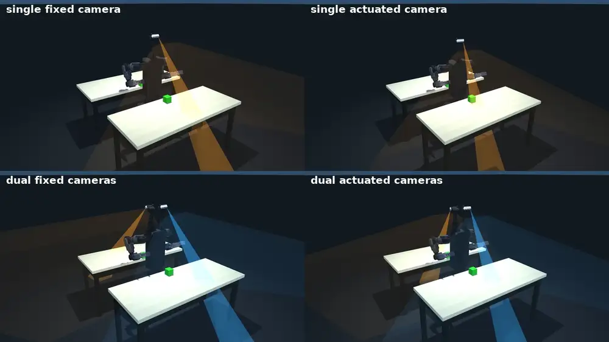
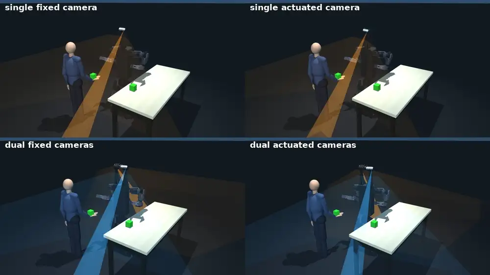
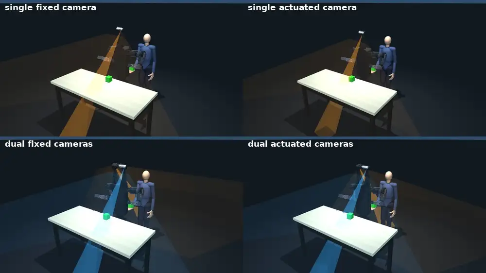

# visual manipulation

The two-target reach-and-grasp benchmark: the robot must locate and grasp two objects placed
to its left/right or front/back, with the camera configuration as the variable under test.
This is the task side of the paper's claim that visible-reachable coverage predicts task
performance.

## The six scenarios

Every cell the benchmark scores, one clip each. Each panel is a 2x2 of camera configurations
running the same layout and the same seed: `v2_single_fixed` and `v2_single` on the top row,
`v2_fixed` and `v2` on the bottom. Watch the welded-camera halves stall on the target they
cannot see.

<table>
<tr>
<td width="50%"></td>
<td width="50%"></td>
</tr>
<tr>
<td><b><code>left_right_close</code></b><br>Both targets already within reach.</td>
<td><b><code>left_right_far</code></b><br>Benches at 0.8 m, so the robot walks between grasps.</td>
</tr>
<tr>
<td></td>
<td></td>
</tr>
<tr>
<td><b><code>front_back_close</code></b><br>The second target starts behind the robot.</td>
<td><b><code>front_back_far</code></b><br>Behind and out of reach: locate, turn, walk, then grasp.</td>
</tr>
<tr>
<td></td>
<td></td>
</tr>
<tr>
<td><b><code>bimanual_mixed_close</code></b><br>One target per hand, so neither arm serves both.</td>
<td><b><code>bimanual_mixed_front_back_close</code></b><br>The same handoff, pair split front and back.</td>
</tr>
</table>

Rebuild any of these with `media/blender_6scenario/build_v2_quadrants.sh`, then
`scripts/make_benchmark_clips.sh`.

## Run one mission

The smallest thing that shows the benchmark working. One robot, one scenario, live viewer:

```bash
python test/curobo_reach_verify.py \
    --robot v2 --scenario bimanual_mixed_close --dynamic --mpc --walk --camera --view
```

Drop `--view` to run headless and print only the verdict.

**Robots:** `v2` (actuated pair, the adopted design), `v2_fixed` (same robot, cameras welded),
`v2_single`, `v2_single_fixed`, `g1`.
**Scenarios:** the six above, plus `front_far_discover`, `shelf` and `shelf_pick_both`, which
are defined and runnable but are not part of the scored table.

A single verdict is not a benchmark. The GPU contact solver is not bit-reproducible, so the
same command has been seen to both pass and fail on the same cell. Use `dyn_sweep.py` for any
number you intend to report.

## Run the whole table

```bash
python test/dyn_sweep.py --robots g1,v2_fixed,v2,v2_single_fixed,v2_single --out <run_name>
python test/dyn_aggregate.py <run_dir>
```

5 configurations × 6 scenarios × 3 repeats × 10 seeded layouts = 900 trials, multi-GPU.
Hours, not minutes. Expected output and the caveats on rerunning are in the top-level
[simulation README](../../../README.md#two-target-reach-and-grasp-benchmark-table-iv).

## What each piece does

| Path | Role |
|---|---|
| `test/curobo_reach_verify.py` | One mission, one verdict. The debugging entry point. |
| `test/dyn_sweep.py`, `test/dyn_aggregate.py` | The full benchmark and its aggregation. |
| `test/make_keyframe_figure.py` | The task keyframe grid, one row per scenario. |
| `test/checkpoints/` | Pinned policy weights, with the md5 and training command for each. Has its own README. |
| `pickplace_scenarios.py` | The scenario definitions: object placement, bench distance, human figure. |
| `reach_policy.py` | The mission state machine: SEARCH, GO, REACH, PARK per visit. |
| `planner.py`, `curobo/` | cuRobo plan and MPC session management. |
| `jacobian_reach_tracker.py`, `mink_reach_tracker.py` | The two trackers that execute a plan through physics. |
| `moving_policy.py` | The reachability gate, shared with the deploy stack. |

## Mission flags

Each one changes what is being tested, so they are not decoration:

| Flag | With it | Without it |
|---|---|---|
| `--dynamic` | realizes the plan through the frozen RL policy and MuJoCo physics | idealized kinematic `mj_forward`; a pass proves only the plan was valid |
| `--camera` | reaches only cubes the head cameras actually see | privileged: reaches any cube whose ground-truth pose is reachable |
| `--walk` | multi-cube mission, base drives until the cube is arm-reachable | one parked reach from the start stance |
| `--mpc` | per-tick reactive tracker, the only path with gravity compensation | a PD servo with no feedforward; the arm droops on every grasp |

`--camera` is the flag that makes a run test the paper's claim rather than the arm alone.
Without it a blind but reachable cube still gets picked up, which is exactly the deficit the
visible-reachable workspace measures.

## Rebuilding the cuRobo models

[`readme_visual_manipulation.md`](readme_visual_manipulation.md) is the recipe for
regenerating the cuRobo motion-planning models for both bimanual robots, gripper grafted. Read
it before touching anything under `curobo/`.
